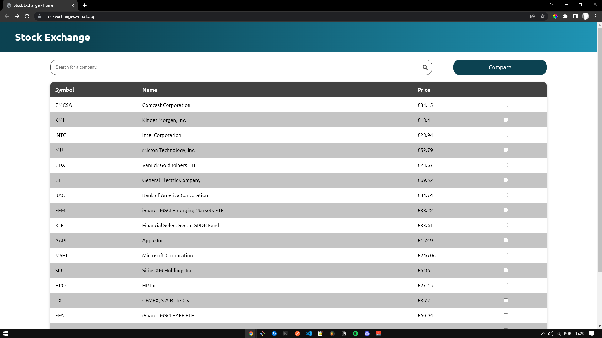
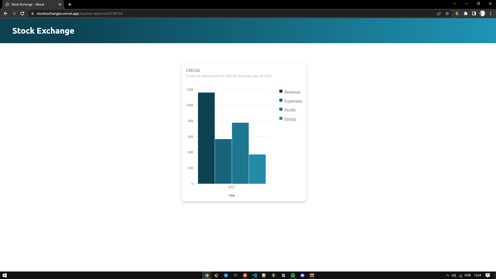
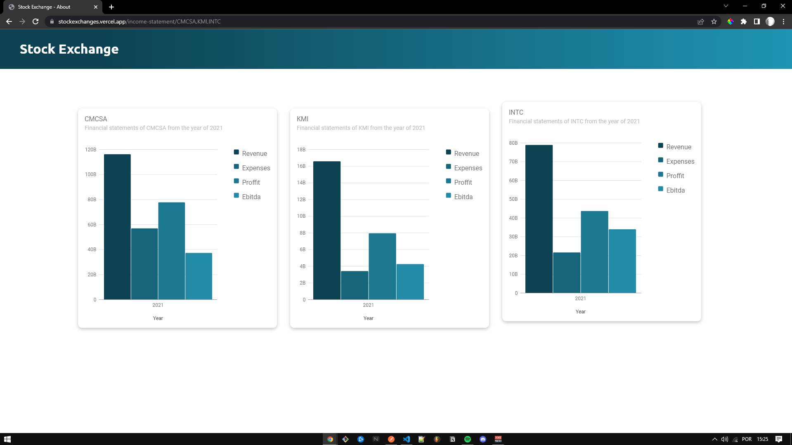
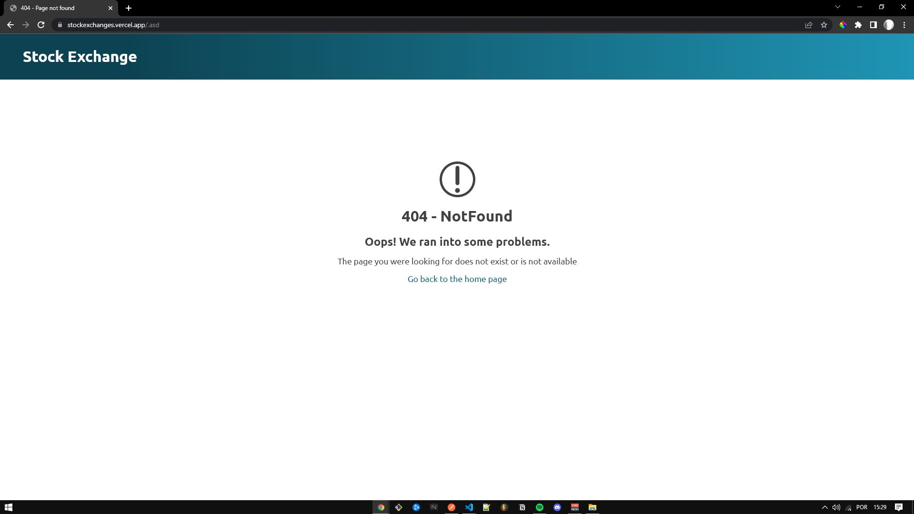
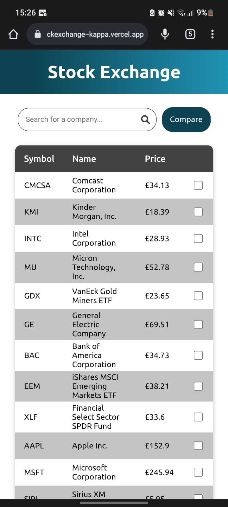
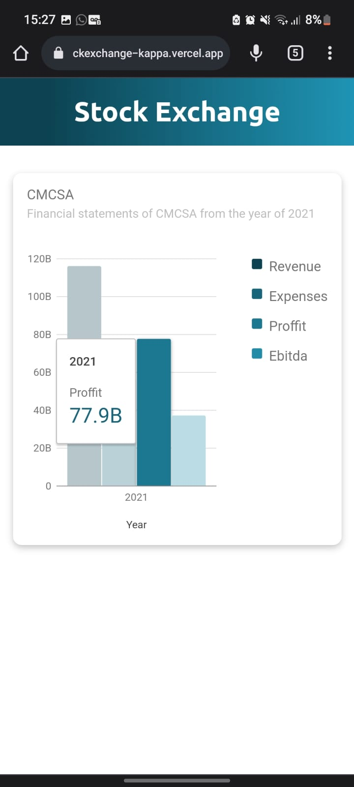
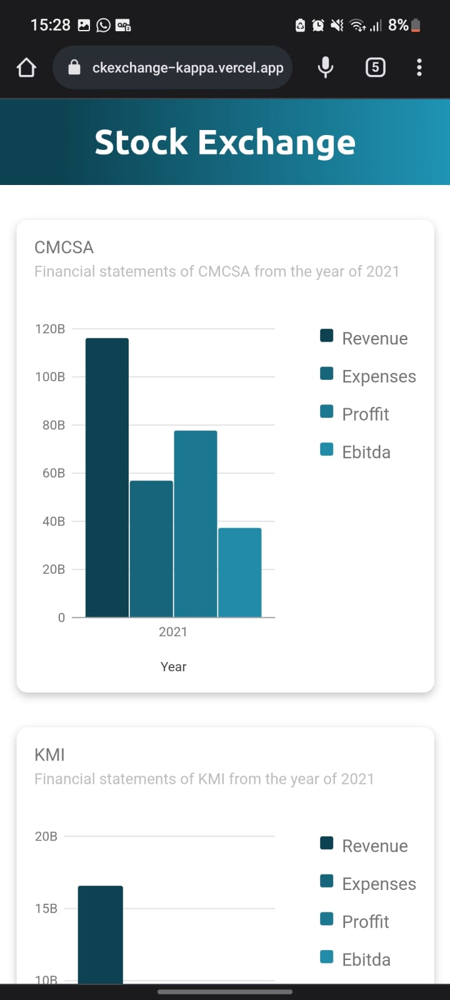
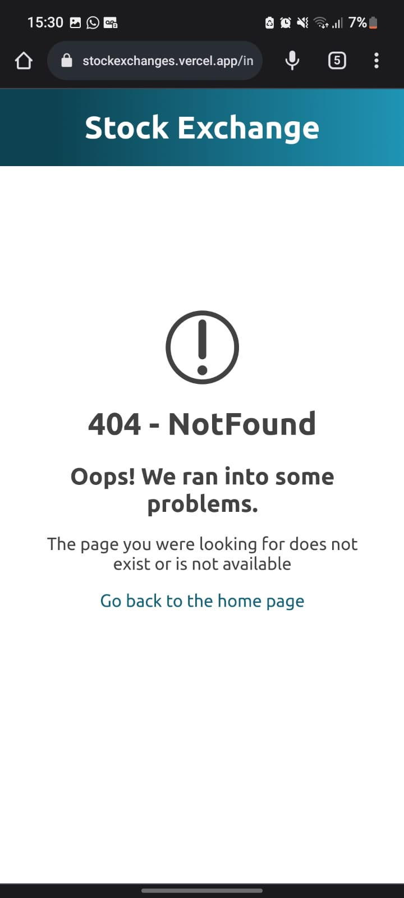

## **Chart**

Projeto de estudo, com intuíto de aprimorar boas práticas em React e no coneceito de Mobile First, e também, adquirir mais conhecimento com TypeScript e Sass.


## 🚀 Tecnologias usadas
- [TypeScript](https://www.typescriptlang.org)
- [React](https://pt-br.reactjs.org)
- [Node.js](https://nodejs.org/en)
- [Sass](https://sass-lang.com)
- [Google Charts API](https://www.react-google-charts.com/)
- [Financial Modeling Prep](https://site.financialmodelingprep.com/developer/)


## 🖥 **Preview**
<p aling="center">
        
</p>
<p aling="center">
    
</p>
<p aling="center">
    
</p>
<p aling="center">
    
</p>
<p aling="center">
    
</p>

## 📱 **Mobile Preview**
<p aling="center">
        
</p>
<p aling="center">
    
</p>
<p aling="center">
    
</p>
<p aling="center">
    
</p>
<p aling="center">
    
</p>
<p aling="center">
    
</p>
## Como executar o projeto

```

Clonar o repositório
git clone https://github.com/brunovdsa/chart

Baixar as dependências
npm i

Executar o servidor
yarn start

```
Depois de fazer isso basta acessar o site: http://localhost:3000/
